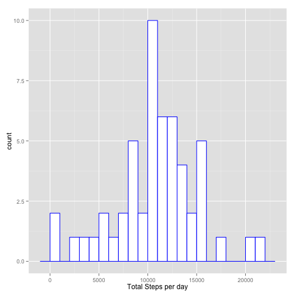
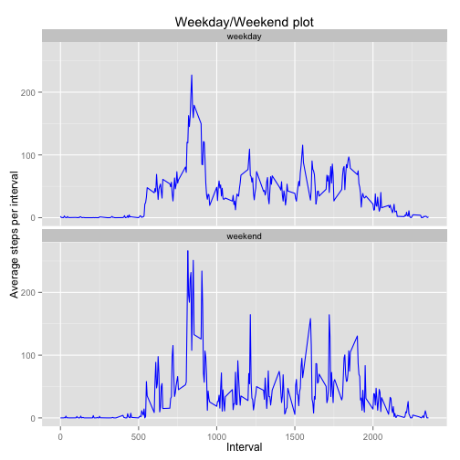

## Loading and preprocessing the data

```r
library(kernlab)
library(dplyr, warn.conflicts = FALSE)
library(ggplot2)
library(knitr)
library(markdown)
data <- read.csv(unzip(zipfile = "./activity.zip"))
```

## What is mean total number of steps taken per day?

```r
total_steps <- aggregate(data$steps, list(Date = data$date), sum, na.rm = TRUE)
ggplot(total_steps[!(total_steps$x == 0),],
       aes(total_steps$x[!(total_steps$x == 0)]), na.exclude = TRUE) +
    geom_histogram(binwidth = 1000, color= "blue", fill = "white") +
    xlab("Total Steps per day")
```

 

Mean total number of steps : 9354.2295082  
Median total number of steps : 10395 


## What is the average daily activity pattern?

```r
time_series_steps <- aggregate(data$steps, list(Interval = data$interval),
                               mean, na.rm = TRUE)
ggplot(time_series_steps, aes(x = time_series_steps$Interval, y = time_series_steps$x)) +
       geom_line(color = "blue") + xlab("Interval") + ylab("Average steps per interval")
```

 

Interval that contains the maximum number of steps on average is : 835  

## Imputing missing values  
  
The number of missing values in the dataset is ``2304``  
  
The missing values in the data set are filled out with the mean value for that 5-minute interval and is named *data_padded*.  


```r
data_padded <- merge(data, time_series_steps, by.x = "interval", by.y = "Interval")
data_padded <- arrange(data_padded, date, interval)
data_padded$steps[is.na(data_padded$steps)] <- data_padded$x[is.na(data_padded$steps)]
total_steps_padded <- aggregate(data_padded$steps, list(Date = data_padded$date), sum, na.rm = TRUE)
ggplot(total_steps_padded[!(total_steps_padded$x == 0),],
       aes(total_steps_padded$x[!(total_steps_padded$x == 0)]),
       na.exclude = TRUE) +
  geom_histogram(binwidth = 1000, color = "blue", fill = "white") +
  xlab("Total Steps per day with Padded data")
```

 

Mean total number of steps : 1.0766189 &times; 10<sup>4</sup>  
Median total number of steps : 1.0766189 &times; 10<sup>4</sup> 

The above values differ from the values in the first part of the assignment. The difference can be explained by the  
addition of padded values.  

## Are there differences in activity patterns between weekdays and weekends?

```r
data_padded <- cbind(data_padded, newDate = as.Date(total_steps_padded$Date))
data_padded$dayType <- ifelse(weekdays(data_padded$newDate) %in% c("Saturday", "Sunday"), "weekend", "weekday")
group_steps <- aggregate(data_padded$steps, list(Interval = data_padded$interval,
                                                 dayType = data_padded$dayType),
                         mean, na.rm = TRUE)
ggplot(group_steps, aes(x = Interval, y = x)) +
    geom_line(color = "blue") + xlab("Interval") +
    ylab("Average steps per interval") + ggtitle("Weekday/Weekend plot") +
    facet_wrap(~dayType, ncol = 1)
```

 
